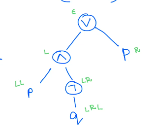

# Propositional Logic
Propositional logic is about how to combine propositions, or assertions. We have certain *atomic propositions* (for example, $2 + 2 = 5$), which can be combined using operators (as in $2 + 2 = 5 \text{ or } 1 + 1 = 2$).  

There are two aspects of logic: its *syntax* (how to write expressions, a kind of grammar) and its *semantics* (what the expressions mean).

## Syntax of Propositional Logic
In propositional logic, we have a denumerable set of *propositional variables*. Elements of this set are typically denoted by $p$, $q$, $p_1$, $q_1$, etc.:
$$\text{Var} = \{p, q, p_1, q_1, \dots\}$$

Using this, we define the set of propositional formulas or expressions:
$$\text{Exp} ::= \text{Var} \mid \text{Exp } \wedge \text{ Exp} \mid \text{Exp } \vee \text{ Exp} \mid \text{Exp } \to \text{ Exp} \mid \neg \text{Exp}$$

This is a definition in BNF, or Backus-Naur form. This can be written alternatively in the inference form:
$$\inferrule[Var]{p \in \text{Var}}{p \in \text{Exp}}$$
$$\inferrule[And]{e_1 \in \text{Exp} \\ e_2 \in \text{Exp}}{e_1 \wedge e_2 \in \text{Exp}}$$
$$\inferrule[Or]{e_1 \in \text{Exp} \\ e_2 \in \text{Exp}}{e_1 \vee e_2 \in \text{Exp}}$$
$$\inferrule[Imp]{e_1 \in \text{Exp} \\ e_2 \in \text{Exp}}{e_1 \to e_2 \in \text{Exp}}$$
$$\inferrule[Not]{e \in \text{Exp}}{\neg e \in \text{Exp}}$$

The set of expressions is the smallest set satisfying these rules.  
These rules give us a way to write the structure of propositional logic expressions as trees (abstract syntax trees).


This can be implemented in Haskell (mirroring the inference rules and the BNF grammar) in this way:
```hs
data Exp = Var Char
         | And Exp Exp
         | Or  Exp Exp
         | Imp Exp Exp
         | Not Exp
```
assuming that the set of propositional variables can be mapped to the set of characters.  

These definitions are *inductive*, in that they define the set of expressions by building up.

### Functions on Propositional Logic Expressions
We can define a number of functions on propositional logic expressions.  

For example, the function $\text{vars} : \text{Exp} \to \text{Var}$, which gives the set of all variables contained in an expression, can be defined recursively:
$$\begin{split}
\text{vars}(p) &= \{p\} \\
\text{vars}(e_1 \wedge e_2) &= \text{vars}(e_1) \cup \text{vars}(e_2) \\
\text{vars}(e_1 \vee e_2) &= \text{vars}(e_1) \cup \text{vars}(e_2) \\
\text{vars}(e_1 \to e_2) &= \text{vars}(e_1) \cup \text{vars}(e_2) \\
\text{vars}(\neg e) &= \text{vars}(e) \end{split}$$

Similarly, we can define the functions $\text{size} : \text{Exp} \to \mathbb{N}$ and $\text{height} : \text{Exp} \to \mathbb{N}$.

### Substitutions
In the AST of an expression, each node has an "address", given by how to reach it from the root.



Thus, given an expression, there is a set of addresses associated with it, for which we can define a function $\text{addr} : \text{Exp} \to \mathcal{P}(\text{Addr})$. The set Addr of all possible addresses is clearly $(L + R)^*$.  

If $e$ is an expression and $p \in \text{addr}(e)$, then there is a unique expression associated with $e$ and $p$ called the subexpression of $e$ at address $p$. Thus we can define a function $\text{subexp} : \text{Exp} \times \text{Addr} \to \text{Exp}$.  
We can also define $\text{graft} : \text{Exp} \times \text{Addr} \times \text{Exp} \to \text{Exp}$, which removes a subexpression at a particular address in an expression, and replaces it with a different expression.  
A related function $\text{occurrences} : \text{Exp} \times \text{Exp} \to \mathcal{P}(\text{Addr})$ gives the set of addresses in an expression at which a given subexpression can be found.  

Finally, we can define $\text{substitute} : \text{Exp} \times \text{Exp} \times \text{Exp} \to \text{Exp}$, which replaces all occurrences of a subexpression in an expression with another expression.
